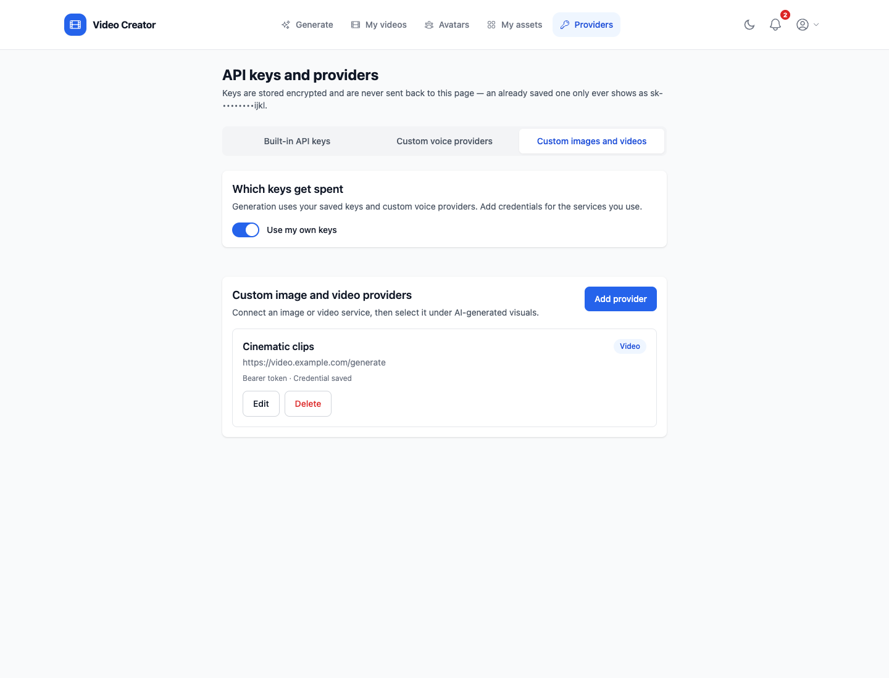
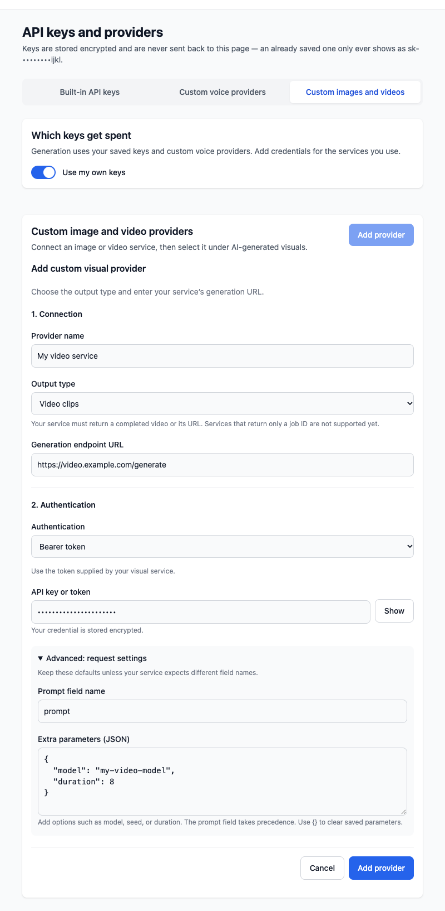
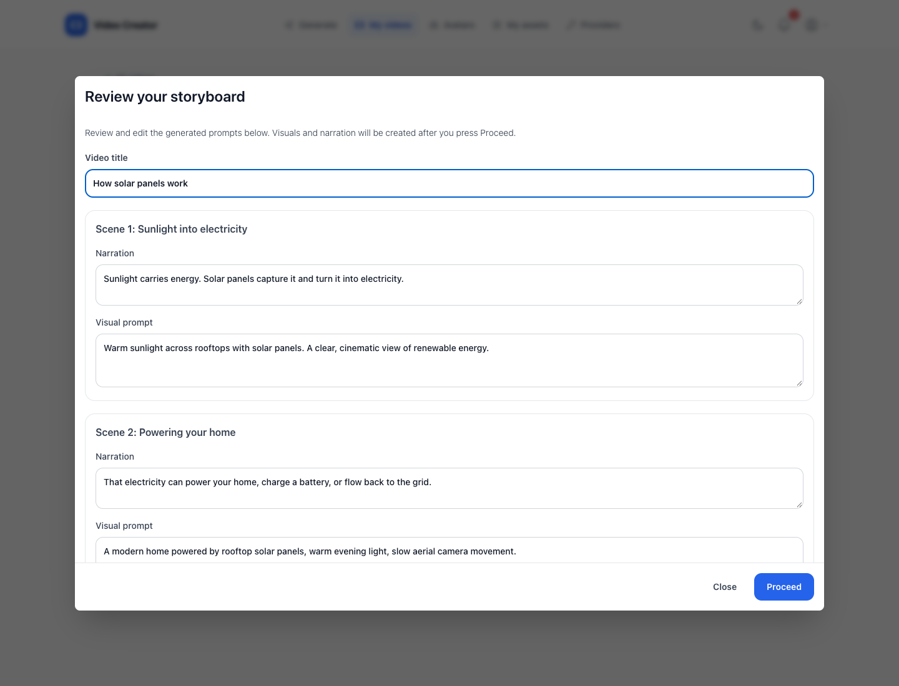
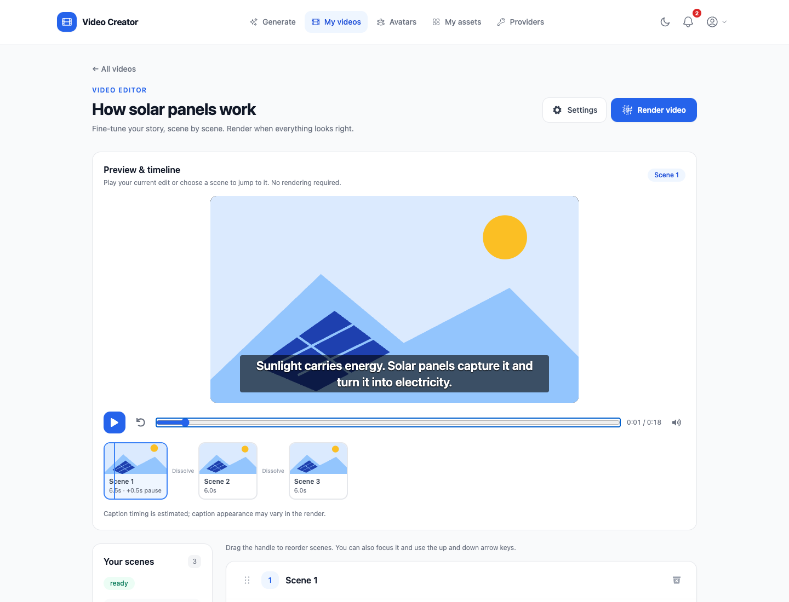
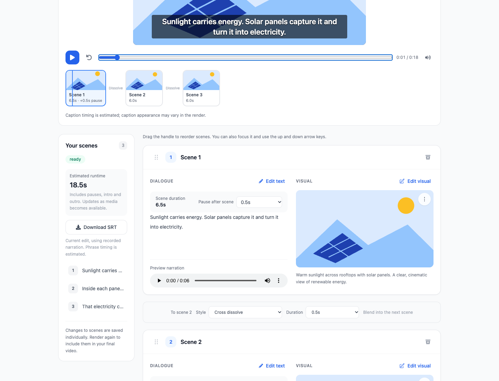

# Viddie - AI-Powered Video Creation

Viddie turns a prompt into an editable video. Draft a storyboard, review its dialogue
and visual prompts, generate the media, then refine individual scenes before rendering.
The React frontend and Django API run together with background workers for generation
and rendering.

## Features

- **Review before generation:** edit the generated storyboard before creating audio
  and visuals, or return to the draft from your video library.
- **Choose your media:** use web images, built-in AI visual providers, or your own
  image and video APIs. Optional reference images guide OpenAI images and Sora shots.
- **Choose your narrator:** use OpenAI, ElevenLabs, 60dB or custom voice providers,
  add a SadTalker presenter, or turn narration off.
- **Edit scene by scene:** rewrite dialogue, replace visuals, draft additional scenes,
  choose their insertion position and drag scenes into playback order.
- **Control playback:** set pauses and choose cuts, fades through black or cross
  dissolves, with video defaults and overrides between scenes.
- **Preview your edit:** play a thumbnail timeline with a seekable playhead, narration,
  transitions, pauses and captions before rendering.
- **Add captions:** render short phrase subtitles and download an SRT file for the
  current edit.
- **Reuse your setup:** save generation templates, avatars, intro and outro clips;
  render in landscape, portrait or square format.
- **Manage your providers:** use service keys or encrypted personal keys, and connect
  custom voice, image and video services from the app.


## Frontend

The React app lives in [`frontend/`](frontend/) and is part of this repository, so a
change that spans the API and the UI is one commit and one review. It was previously
a [separate repo](https://github.com/kostas2370/video_creator_frontend), kept for
history.

Docker serves the app and API through nginx on one origin. The frontend sends API
requests through that origin, including the `SameSite=Strict` authentication cookies.
The development proxy provides the same setup when running React outside Docker.

## Sample Videos

- [Demo Video 1](https://www.youtube.com/watch?v=PvrX_jq4fv4)
- [Demo Video 2](https://www.youtube.com/watch?v=bNZvK68O-Rk)

---

## Configuration

Both installs read the same `.env` in `backend/` (see `backend/.env_example`).
Configure the services you plan to use:

- `OPEN_API_KEY` — used for scripts, images and voices
- `SEARCH_ENGINE_ID` — Google Custom Search engine ID, when using Google web images
- `API_KEY` — Google Custom Search API key, when using Google web images

These are the *service* keys — the ones the server spends on behalf of everyone.
Users can instead supply their own from the app, without touching `.env`; see
[API keys](#api-keys). The service keys are still worth setting, because they are
what new accounts use by default and what the `setup_elevenlabs` and `setup_60db`
commands read.

For Google search setup, see this [video guide](https://www.youtube.com/watch?v=D4tWHX2nCzQ&t=127s).

Blank values are treated as unset. Generation requires credentials for the selected
providers, while other settings use their configured defaults. Useful options include:

| Variable | Default | Purpose |
| --- | --- | --- |
| `DEFAULT_GPT_MODEL` | `gpt-5.4-mini` | Script generation model |
| `MAX_TOKENS` | `3900` | Visible reply budget |
| `REASONING_TOKEN_ALLOWANCE` | `8000` | Extra budget for gpt-5/o-series thinking tokens, which bill against the same cap as the reply |
| `IMAGE_MODEL` | `gpt-image-2` | OpenAI image generation model |
| `IMAGE_QUALITY` / `IMAGE_SIZE` | `high` / `1792x1024` | Validated per model — change them together with `IMAGE_MODEL` |
| `SUBTITLE_FONT` | `DejaVu-Sans` | ImageMagick font name for subtitles |

The generation form accepts an optional PNG, JPEG, or WebP reference image up to
10 MB when using OpenAI images or Sora. OpenAI images reuse this reference for every
scene; Sora uses it to start the first shot and then follows each preceding clip.
The uploaded reference stays with the video for resume and regeneration.

Without an upload, OpenAI scene images reuse the first successful image as an identity and style
reference through the image edits API. They generate in sequence; reference inputs
can add API cost. Sora shots use the preceding clip's last visible frame, resized to
the configured video resolution, as their opening reference. Resuming a generation
or regenerating a scene recovers references from saved visuals. This improves visual
continuity but does not guarantee identical characters or uninterrupted motion; Sora
shots are separate jobs, not native video extensions. Existing completed visuals are
kept until you regenerate them.

---

## How to Run the Project

Docker is the fastest way in and the one most people should use: it brings up the
API, the worker, the database and the frontend together, patches the ImageMagick
policy, ships a subtitle font and downloads the model weights for you. Install it
by hand if you would rather run the services yourself.

### Docker Installation

1. Create the `.env` file as described under [Configuration](#configuration).
2. Navigate to the backend folder and run:
   ```shell
   docker compose up --build
   ```

This brings up the whole stack, frontend included:

| | |
| --- | --- |
| App | <http://localhost:3000> |
| API | <http://localhost:3000/api/> (also on `:8000` directly) |
| Admin | <http://localhost:3000/admin/> |
| Swagger | <http://localhost:3000/swagger/> |

nginx serves the built app and proxies `/api`, `/admin`, `/swagger` and `/redoc` to
Django, so everything is one origin.

Rendered videos, scene images and narration audio under `/media` are served by nginx
straight off the bind mount rather than through Django. Django's development static
view does not implement range requests, so a browser could not seek in a rendered
video and had to download the whole file before playing it.

The frontend image is a multi-stage build — node compiles the bundle and only the
static output plus nginx is shipped, so it is around 100MB rather than the couple of
GB an installed `node_modules` takes.

To work on the frontend with hot reload, run it outside Docker instead:

```shell
cd frontend && npm install && npm start
```

CRA's dev server proxies `/api` to `localhost:8000` (see `proxy` in `package.json`),
so the browser still sees a single origin and the cookies behave the same way.

Everything above is handled inside the image: the ImageMagick policy is patched, a
subtitle font is present, and the web container runs migrations and loads fixtures on
start. The stack builds natively on both x86\_64 and arm64 (Apple Silicon).

The model weights are downloaded for you: the celery worker runs `setup_checkpoints` before it starts consuming tasks, since it is the service that runs SadTalker. They land in `checkpoints/` and `gfpgan/weights/` on the host through the `.:/app` bind mount, so the first boot pays for the download once and every rebuild after that reuses it. Expect the worker to take several minutes to come up the first time.

They are deliberately **not** baked into the image — that would add several GB to it, and they are not needed at build time.


---

### Manual Installation

#### Prerequisites

- Required Python version: 3.11 (Docker and CI use this version)
- Backend framework: Django 5.2 LTS with Django REST Framework 3.18.
  Package metadata, Docker, and CI share `backend/requirements/requirements.txt`.
- Install the following dependencies:
  1. FFmpeg, including `ffprobe` (Required for video rendering and reading media timing) - [Installation Guide](https://phoenixnap.com/kb/ffmpeg-windows)
  2. ImageMagick (Required for subtitles) - [Download](https://imagemagick.org/script/download.php#windows)

     On Linux, the packaged `policy.xml` blocks the `@file` reads that moviepy uses to
     draw text, so every subtitle fails with *"operation not allowed by the security
     policy"*. Delete this line from `/etc/ImageMagick-*/policy.xml`:

     ```xml
     <policy domain="path" rights="none" pattern="@*"/>
     ```

     Subtitles are drawn with the font named by `SUBTITLE_FONT` (default
     `DejaVu-Sans`). Run `convert -list font` to see what your install offers — on
     macOS and Windows `Arial` works, in debian-slim only the DejaVu family exists.

#### Installation Steps

1. Navigate to `backend/` and install dependencies in a Python 3.11 virtual environment:

   ```shell
   pip install --upgrade pip
   pip install torch==2.5.1 torchvision==0.20.1 torchaudio==2.5.1 --index-url https://download.pytorch.org/whl/cpu
   pip install -r requirements/build.txt
   PIP_CONSTRAINT=requirements/constraints.txt pip install --no-build-isolation -r requirements/requirements.txt
   ```

   The constraints file holds torch to the CPU build. Without it, several of the
   SadTalker dependencies pull a CUDA build in and add roughly 2.5GB of `nvidia-*`
   packages that nothing here can use.

   On Debian or Ubuntu, install `default-libmysqlclient-dev` and `pkg-config`
   before installing Python dependencies. These build Django’s MySQL driver.

2. Download the SadTalker and GFPGAN model weights:

   ```shell
   python manage.py setup_checkpoints
   ```

   This fills `checkpoints/` and `gfpgan/weights/` and skips anything already there, so it is safe to re-run if a download drops out. The files come from [Google Drive - Checkpoints](https://drive.google.com/drive/u/1/folders/1Fp4sjMi6U3bQaKmQQe04qeXzk7quu0Od) if you would rather fetch them by hand — note that the `gfpgan` subfolder belongs at `gfpgan/weights/`, not inside `checkpoints/`.

3. Create the `.env` file described under [Configuration](#configuration).

4. Run the following commands to set up the database and start the server:

   ```shell
   python manage.py migrate
   python manage.py loaddata fixtures/fixtures.json
   python manage.py setup_media
   python manage.py createsuperuser
   python manage.py runserver
   ```

   Migrations are committed to the repo, so `migrate` is all you need. If you change a
   model, generate them with the app labels — `makemigrations usermanagement
   videomanagement` — since a bare `makemigrations` silently skips any app whose
   `migrations/` package is missing and reports "No changes detected".

   `fixtures.json` carries the voice catalogue and nothing else — no accounts — so
   `createsuperuser` above is what gives you a login. See
   [Creating a superuser](#creating-a-superuser) if you would rather not answer its
   prompts.

   Voices are all API-backed — OpenAI, ElevenLabs or 60dB. The fixtures load the six
   OpenAI voices, so `OPEN_API_KEY` alone is enough to render speech. Local on-device
   synthesis (coqui/TTS) has been removed: it pinned the project to a dependency tree
   that no longer resolves on the previous Python 3.9 runtime, and it was the single largest contributor to
   the image size.

5. (Optional) To enable ElevenLabs voices, add your `XI_API_KEY` in the `.env` file and run:

   ```shell
   python manage.py setup_elevenlabs
   ```

6. (Optional) To enable 60dB voices, add your `SIXTYDB_API_KEY` in the `.env` file and run:

   ```shell
   python manage.py setup_60db
   ```

   This imports your 60dB voices into the database. Once imported, a 60dB voice can be
   selected for a video just like any other voice — synthesis is routed automatically.

7. Run Redis and a Celery worker for media generation, rendering and voice imports.
   For Redis running locally, set `CELERY_BROKER_URL=redis://localhost:6379/0` in
   `backend/.env`; `CELERY_RESULT_BACKEND` and `VIDEO_EVENTS_REDIS_URL` use that URL
   unless overridden. From `backend/`, start the worker in another terminal:

   ```shell
   celery -A video_creator worker --loglevel=info
   ```

   Start the scheduler in its own terminal for scheduled tasks:

   ```shell
   celery -A video_creator beat --loglevel=info
   ```

8. From the repository root, start the frontend in another terminal:

   ```shell
   cd frontend && npm install && npm start
   ```

   It opens on <http://localhost:3000> and proxies `/api` to the Django server on
   `:8000`, so the browser sees one origin and the auth cookies work. Open the app on
   `localhost`, not `127.0.0.1` — they count as different sites, and the
   `SameSite=Strict` refresh cookie would not be sent.

---

## Admin Panel

- URL: [http://localhost:3000/admin/](http://localhost:3000/admin/) under Docker, or
  [http://localhost:8000/admin/](http://localhost:8000/admin/) against `runserver`.
- The fixtures ship no accounts, so create your own — see below.


## Creating a superuser

`createsuperuser` prompts for a username, email and password:

```shell
python manage.py createsuperuser
```

That is enough for the admin, but **not** to sign in through the app: the API login
also requires `is_verified`, which is normally set by following a link emailed at
signup and so never gets set with no SMTP configured locally. This one-liner creates
the account and verifies it in a single step:

```shell
python manage.py shell -c "
from apps.usermanagement.models import User
User.objects.create_superuser(
    username='admin',
    email='admin@example.com',
    password='change-me',
    is_verified=True,
)
"
```

Under Docker, run it in the web container:

```shell
docker compose exec video_creator python manage.py shell -c "..."
```

To verify an account you already made, rather than creating one:

```shell
python manage.py shell -c "from apps.usermanagement.models import User; User.objects.filter(username='admin').update(is_verified=True)"
```

## API keys

Keys do not have to live in `.env`. Signed in, choose **Providers** in the main menu,
or **API keys and providers** in the account menu, to manage your own from the
browser (<http://localhost:3000/api-keys/>).

The page has three tabs: **Built-in API keys** for the supported services,
**Custom voice providers** for your own text-to-speech service, and
**Custom images and videos** for your own visual generation service. Switching tabs
keeps unsaved changes in place.


The page has one switch at the top that selects keys for built-in services and
controls access to custom voice providers:

| Switch | What gets used |
| --- | --- |
| **Use my own keys** — off (default) | The service keys from `.env`. Your saved built-in keys and custom voice providers are kept but unused. |
| **Use my own keys** — on | Your saved provider keys and your custom voice providers. |

The **Built-in API keys** tab lists the supported services: OpenAI, Anthropic, Google Gemini,
ElevenLabs, 60dB, Stable Diffusion, Midjourney, Google Custom Search (key and engine
id). Enter the keys you want to change, then
click **Save**. Only changed fields are sent, so updating one never disturbs the
rest. **Clear** marks a single key for removal on save; **Remove all my keys** removes
all built-in provider keys after confirmation. Custom providers are managed separately
in their own tabs.


Two things to know before switching over:

- **There is no fallback.** With your own keys selected, a provider you left blank has
  no key at all — it does not quietly fall back to the service key, and the steps that
  need it will fail. Fill in every provider you actually use.
- **Keys are write-only.** They are stored encrypted and never sent back to the
  browser; a saved key only ever shows masked, as `sk-••••••••ijkl`. That also means
  there is no way to read one back out of the UI — if you lose the original, replace it.

### Custom voice providers

Open the **Custom voice providers** tab to connect your own text-to-speech API.
Each card shows its authentication method and whether a voices URL is configured.
Custom voices are available only while **Use my own keys** is on; the tab offers a
shortcut to switch if service keys are selected.


Choose **Add provider** and fill in the three sections:

1. **Connection:** give the provider a unique name and enter its speech endpoint URL.
2. **Authentication:** choose a bearer token, custom header, basic authentication
   (`username:password`), or no authentication. Enter the header name when using a
   custom header.
3. **Voices:** optionally enter a voices URL. Without one, the provider can be saved,
   but it will not import voices into the generation picker.


Under **Advanced: request settings**, the defaults are `text` and `voice_id`.
Change them if your service expects different JSON field names. The speech endpoint
receives a POST with those two fields and should return audio bytes. **Extra parameters
(JSON)** adds options such as a model or speaking speed; the text and voice fields
override extra parameters with the same names.

The voices URL must be accessible without authentication. It can return a JSON list,
or an object containing that list under `voices` or `data`. Each voice needs `id` and
`name`; `preview_url` is optional. For example:

```json
{
  "voices": [
    { "id": "narrator", "name": "Narrator" }
  ]
}
```

Adding a provider queues its initial voice import. Failed imports keep previously
imported voices; successful refreshes update their names and preview URLs and remove
voices no longer returned by the service. Use **Refresh voices** after editing
its connection or when the service's voice list changes, then reload the generation
page after the background import finishes. “Voice import queued” means the request was
accepted; it does not confirm that the import has completed.

**Edit** opens the form inside the card. Leave the credential field blank to keep the
saved credential, type a replacement to change it, or select **Clear saved credential
on save** to remove it. **Show** reveals only the replacement you typed. Provider
names stay fixed after creation; add a new provider to use a different name.

**Delete** asks for confirmation and removes the provider and its imported voices.
Unsaved form changes are kept until you save or explicitly discard them.

### Custom image and video providers

Open **Providers → Custom images and videos** to connect an image or video API.
These providers belong to your account and use their configured credentials,
regardless of the **Use my own keys** switch.



Choose **Add provider** and enter:

1. **Provider name:** a unique name, different from the built-in provider names.
2. **Output type:** **Video clips** or **Still images**.
3. **Generation endpoint URL:** the endpoint that accepts the generation request.
4. **Authentication:** bearer token, custom header, basic authentication
   (`username:password`), or no authentication. For a custom header, also enter its name.

Under **Advanced: request settings**, change **Prompt field name** if your API uses
something other than `prompt`. **Extra parameters (JSON)** accepts an object for
settings such as a model or duration. For example, `{"model": "my-video-model", "duration": 8}`.
The generated prompt overrides any extra parameter with the same field name.



The service receives a JSON POST for each scene. With the defaults and the example
parameters above, the request looks like:

```json
{
  "prompt": "A slow camera pan across a sunlit mountain lake",
  "model": "my-video-model",
  "duration": 8
}
```

The endpoint must return completed media bytes, or JSON containing an HTTP(S) media
URL. Set the response's `Content-Type` to `application/json` when returning JSON:

```json
{
  "video_url": "https://media.example.com/clips/generated.mp4"
}
```

`url` is also accepted, as is `image_url` for still images. The URL can instead be
inside the first item of a `data` array, such as `{"data": [{"url": "https://media.example.com/generated.mp4"}]}`.
Returned URLs must be downloadable without additional authentication headers;
a signed URL works. The configured credentials are sent only to the generation endpoint.
Services that return only a job ID and require polling are not supported.

After saving, choose **AI-generated visuals** on the generation page, then pick your
provider under **Custom video providers** or **Custom image providers** in
**Visual provider**. **Manage custom images and videos** opens the provider settings.

Use **Edit** to change the endpoint, output type, authentication, or request settings.
Leave the credential blank to keep it, enter a replacement, or select **Clear saved
credential on save** to remove it. Names stay fixed after creation. **Delete** removes
the provider after confirmation; media already generated remains available.

### Keys and voices

After updating an existing installation, run `python manage.py migrate` in the
backend (or `docker compose exec video_creator python manage.py migrate` from
`backend/`). The provider-name migration updates saved voice records to `OPENAI`,
`ELEVENLABS`, and `SIXTYDB`. Until it is applied, existing service voices with old
provider names will not appear in the picker.

Restart running Celery services after updating backend code so they load the current
provider registry and tasks: `docker compose restart celery celery-beat` from
`backend/`. Existing workers keep their previously loaded code until restarted.

The built-in voices you can pick follow the keys you hold:

- **A provider with no key is hidden.** No OpenAI key — service or your own, whichever
  the switch selects — and the OpenAI voices disappear from the picker, from the "Any
  voice" fallback, and from a hand-crafted API request. Clear every key and the list is
  empty for built-in providers. Custom voices remain available under your own-key
  mode if you have configured a custom provider.
- **Saving an ElevenLabs or 60dB key imports that account's voices.** A background job
  picks them up a moment after you save, so they appear on the next reload. They are
  yours: nobody else sees them, and re-saving the same key does not duplicate them.
- **Voices follow the account that owns them, in both directions.** An ElevenLabs
  `voice_id` belongs to the account that minted it, so the picker only ever shows the
  ones your current key can actually reach: your imported voices while the switch is
  on *Use my own keys*, and the ones `setup_elevenlabs`/`setup_60db` imported with the
  service key while it is off. Neither set is offered with the wrong key behind it.

The OpenAI voices the fixtures ship are shared with everyone, because `alloy` and the
rest are built-in names that work with any OpenAI key — unlike an ElevenLabs voice,
which is minted inside one account.

Encryption uses `FIELD_ENCRYPTION_KEY`, which is derived from `SECRET_KEY` when it is
not set. That is fine locally, but on anything you intend to keep, set it explicitly
and never change it afterwards — rotating it (or rotating `SECRET_KEY` while it is
unset) makes every stored key undecryptable. Generate one with:

```shell
python -c "from cryptography.fernet import Fernet; print(Fernet.generate_key().decode())"
```

## Notifications

Generation and rendering take minutes, so the bell in the top right tells you when one
of your videos is done — or when it stopped. Each entry links to the video it is about,
and the badge counts what you have not read yet.


Notifications remain available when you return to the app. Email notifications are
also sent when email delivery is configured; local development prints emails to the
server console by default.

## Creating a video

Open **Generate** and work through the form:

1. **Your story:** enter your prompt, choose an example idea, or load a saved template.
   Set **Number of scenes** to 1–60, or leave it blank to let AI choose. The form
   starts at eight scenes, with one short spoken sentence per scene.
2. **Voice and visuals:** choose a presenter or voice and select web images or
   AI-generated visuals. Custom image and video services appear in **Visual provider**.
   Turn **Narration** off when you do not want a voice-over.
3. **Reference image:** when using OpenAI images or Sora, optionally upload a PNG,
   JPEG or WebP image up to 10 MB and describe how to use it in your prompt.
4. **Fine-tune your video:** set the audience, tone or genre, script model, background
   music, subtitles, platform and output format. TikTok selects portrait framing and
   captions by default; landscape (16:9), portrait (9:16) and square (1:1) are available.
5. Check the **Your video** summary and choose **Generate video** to draft the storyboard.

The form stacks vertically on smaller screens. Background music accepts a YouTube
URL; **Add subtitles** is available while narration is enabled.


Generation first drafts a storyboard. A review modal shows the generated narration
and visual prompts for every scene; edit them and press **Proceed** to create the
visuals and audio. Closing the modal leaves the draft awaiting review in your video
library. Open it in the editor and choose **Review storyboard** to continue.



After choosing **Proceed**, media generation runs in the background. Find the video
under **My videos**, then edit its scenes and choose **Render video** when ready.
Generation and rendering are separate steps, so you can refine the media first.

## Templates

A template is a saved copy of the generation form — the prompt and every setting under
it. Fill the form in and use **Save as template** in the **Your video** panel to name
and keep it. Picking it from **Start from a template** later fills the whole form back
in, and **Delete** next to that dropdown deletes the currently selected template.


The selected template fills the form and shows **Delete** beside the dropdown:


Templates are per user: nobody else sees yours, and two people can each keep one called
*Shorts* without colliding. A name has to be unique within your own templates, so saving
over an existing name is refused rather than silently replacing it — delete the old one
first, or pick another name.

## Navigation

The main menu links to generation, your videos, avatars, assets, and providers.
It highlights the current section and collapses into a menu on smaller screens. The
account menu, notifications, and theme switch are available in the header.


## Your videos

Search your library by title and use the status badges to see what is ready, finished,
or still being worked on. **Review prompts** opens a pending storyboard, **Edit scenes**
opens an editable video, and **Watch** previews a finished render. The actions menu
offers details and the render, resume or delete actions available for that video.
**Create video** starts a new story.


A generation that stopped early is not a dead end. **Carry on generating** in its
actions menu carries it on from
where it got to — only the lines with no narration and the shots with no image are made
again, so nothing already generated is paid for twice.


## Editing a video

Open a video from the list and every scene is there to change before you render: the
narration line and its audio, the image behind it, and the order they play in. Scenes
can be added, edited, regenerated or removed one at a time, so a single bad shot does
not mean generating the whole thing again.


### Preview and timeline

**Preview & timeline** plays the current edit without generating a video file or
spending generation credits. Choose a scene thumbnail to jump to its start, drag the
playhead to seek, or use **Play**, **Pause**, **Restart** and **Mute**. Intro and outro
clips appear in playback order alongside the scenes. The active scene is highlighted,
and a moving line shows your position within it.

The preview follows saved scene order, durations, pauses and transition settings.
Narration and retained clip audio play together; pauses hold the final frame in
silence. Captions appear when subtitles are enabled, using the same estimated phrase
cues as rendering and SRT export. Portrait, landscape and square framing use the
selected output format. Playback waits for buffering and pauses when you leave the tab
or open an editing dialog.

Saving playback changes reloads the preview, ready to play from the beginning. Preview
is unavailable while generation or rendering is running. Missing visuals show a
placeholder; media failures display a notice and can be retried by reloading the preview.

This previews scene media and narration. Avatar animation, background music and
background effects are added during rendering; caption appearance may also differ.



Scenes are numbered in playback order. **Insert position** in **Add scene** lets you
choose **At the end** or **Before scene N** and shows where the new scenes will fit.
Later scenes shift down, and a batch stays together in its reviewed order. New scenes
go at the end by default.

Drag the handle on a scene card to change its playback position using a mouse or
touchscreen. With the handle focused, the up and down arrow keys move the scene,
and Escape cancels an active drag. Order saves automatically; a failed save restores
the previous order. Reorder scenes from their cards in the main editor; the editing
dialogs are for changing a scene's content or the video's settings.

Use the scene navigator to jump between numbered scene cards. **Edit text** opens
the dialogue editor, where you can review an AI rewrite before saving. **Edit visual**
lets you upload an image or video with a preview, or generate a new image.

### Adding and rewriting scenes

Choose **Add scene**, set its insertion position, then choose a creation mode:

- **Write it yourself:** enter dialogue and an optional visual description, or upload
  an image or video to use as the visual.
- **Create with AI:** describe what should happen and draft a sentence, section or
  short story. Sections start at three sentences and stories at six; choose up to
  twelve. **With context** includes the video's title and current scenes;
  **No context** sends only your new instructions. Choose **Generate draft** to
  review the proposed scenes.

Review the generated dialogue and visual descriptions, edit or remove individual
items, then add the remaining scenes together. Drafting alone does not insert scenes.
Under **More options**, **Keep visual audio** retains an uploaded clip's sound and
**End of scene group** marks a manually added scene as a group ending.

To change existing dialogue, choose **Edit text**. Edit it directly or describe a
change under **Rewrite with AI**, then choose **Generate rewrite**. Review the result
and choose **Save dialogue** to apply it and regenerate narration. Closing the dialog
before saving leaves the scene unchanged.

### Transitions

Controls between scene cards choose how the next scene begins:

| Style | Effect |
| --- | --- |
| **Cut** | Switch immediately to the next scene. |
| **Fade through black** | Fade the outgoing scene to black, then fade in the next scene. |
| **Cross dissolve** | Blend the outgoing final frame into the next scene's opening. |

In **Settings → Scene transitions**, choose the video's default style and duration.
Each scene boundary can use **Video default** or override the style and duration
independently. Durations range from 0.1 to 3 seconds; **Automatic** lets the renderer
choose. Cut transitions have no duration, and effects are shortened for short clips.
Cross dissolves preserve the total runtime, narration and subtitle timing.

### Scene timing and pauses

Each scene shows its duration and a **Pause after scene** selector. Choose
**No extra pause** or add up to 10 seconds. The pause holds the final visual frame
with silence before continuing; captions stop at the end of the recorded narration.
Existing ending holds remain part of the scene duration.

The sidebar shows **Estimated runtime**, including scene durations, pauses, intro
and outro. It updates as media becomes available and when a pause changes. Timing
changes save automatically, and a failed save restores the previous value. Changing
a pause also clears cached avatar output so the next render uses the updated timing.



### Subtitles and SRT export

Enable **Subtitles** in video settings to include narration captions in the next
render. Dialogue is split at sentence boundaries and into short phrases, wrapped
into one or two lines. Phrase timing is estimated from text length and the recorded
narration duration; voice providers currently do not return word timestamps.
Captions stay out of added pauses and ending holds, and scenes without recorded
narration have no captions.

Choose **Download SRT** in the editor sidebar to download a UTF-8 subtitle file for
the current edit. It uses the same phrase cues as rendered captions, follows scene
order, and includes intro and pause offsets. Missing narration leaves a gap in the
subtitle timeline. SRT export works even when on-screen subtitles are turned off,
but requires recorded narration and waits until processing finishes. The download
belongs to the current edit; render again after changing scenes or timing to match
it to your finished video.

### Saving and rendering

**Settings** opens the video's intro, outro, avatar, transition and subtitle controls.
Reordering scenes, changing transitions or pauses, and downloading SRT files do not
consume generation credits. Playback edits are blocked during generation, storyboard
review and rendering. Changes affect the next render; the existing finished video
stays available until you render again.

**Render video** queues the render once the video is ready and pending playback edits
have saved. While rendering, the button stays disabled.

If narration is missing, an amber notice lists the affected scenes. **Retry narration**
on a scene regenerates its audio while keeping the dialogue and visual. The render
dialog also checks for missing narration: cancel to retry it, or choose **Render anyway**
to use the available audio. Videos with narration turned off do not show this warning.

The screenshots below use the same three-scene video and desktop view as the main
editor above. Opening a dialog overlays the scene cards and their drag handles.

**Video settings** — change the title, format, intro, outro, avatar, transitions and subtitles.


**Render** — confirm rendering; missing narration adds a warning.


**Edit dialogue** — edit directly or review an AI rewrite, then save.


**Edit visual** — upload media or generate an image from a description.


**Add scene** — choose its position, write dialogue or review an AI draft.


**Delete scene** — confirm removal before deleting.


## Avatars and assets

An avatar is a face plus the voice that speaks for it; SadTalker animates it against
the narration. Search your presenters by name and preview their voices from each card.
**Create avatar** pairs a portrait upload with a voice and lets you preview the portrait
before saving.


**My assets** keeps reusable intro and outro clips in separate tabs. Search each
collection, preview a clip, or upload a new one with a name and video preview. Pick
your intro and outro in the video settings.


| | |
| --- | --- |
|  |  |
| **New avatar** — name, gender, voice and a face to animate | **New asset** — upload an intro or outro clip |

## Frontend API requests

Frontend requests use `src/api/request.js` through the helpers in `src/api/apiService.js`.
Every helper returns `{ ok, data, status, message, errors }` plus response headers.
JSON objects and multipart uploads use Axios content-type handling, and search and
pagination values are sent as query parameters. Callers that display their own
validation errors suppress the shared error notification.

## Architecture

For how a request becomes a video — the generation and render pipelines, the status
state machine, resume, and where to add a provider — see
[docs/ARCHITECTURE.md](docs/ARCHITECTURE.md).

Video and scene operations live in `backend/apps/videomanagement/services/`.
Playback edits use the shared editing service to lock the video and validate its
status in one transaction. Media timing, provider integrations and rendering helpers
live in `utils/`; the composer keeps transitions, captions, audio layers and output
assembly in separate modules. Subtitle export and rendering share the same cue builder.

---

## API Documentation

You can find all API endpoints in Swagger: [http://localhost:3000/swagger/](http://localhost:3000/swagger/)
under Docker, or [http://localhost:8000/swagger/](http://localhost:8000/swagger/) against
`runserver`.


---

## Roadmap / To-Do List

- [ ] Convert all `moviepy` functions to `FFmpeg` for better performance.
- [x] Add **Celery** support for asynchronous and scheduled tasks.
- [x] Implement unit tests for models, functions, and views.

---

## Contact & Support

For any inquiries or support, feel free to reach out:

- University Email: [kodamia@cs.ihu.gr](mailto:kodamia@cs.ihu.gr)
- Personal Email: [kostas2372@gmail.com](mailto:kostas2372@gmail.com)

---

## Recent Updates

✅ Refreshed the README guide and screenshots for the current generation and editing workflows\
✅ Added a browser preview timeline with seeking, narration, transitions, pauses and caption cues\
✅ Added storyboard review before media generation, with editable dialogue and visual prompts\
✅ Added scene insertion positions and reviewed AI drafts for sentences, sections and stories\
✅ Moved playback editing rules into a shared transaction service and separated rendering helpers\
✅ Added short phrase captions and UTF-8 SRT downloads with estimated narration timing, scene order, intro and pause offsets\
✅ Added scene durations, estimated total runtime and optional pauses that hold the final frame with silence\
✅ Added cut, fade-through-black and cross-dissolve transitions with video defaults and scene overrides\
✅ Added drag-and-drop scene reordering with touch and keyboard controls and automatic saving\
✅ Added custom image and video providers with configurable authentication, prompt fields, and extra request parameters\
✅ Save the generation form as a named template and pick it again later, with a delete button beside the picker\
✅ Fixed the "video completed" and "video failed" emails, which went out addressed to the subject line rather than to you\
✅ Fixed pressing render on a finished video reporting success before the render had started\
✅ Redesigned the generation form with visible voice and visual controls, Fine-tune your video settings, and a live creation summary\
✅ Added a dedicated custom voice providers tab, with connection and authentication settings, voice imports, and credential management\
✅ Added per-user API keys, managed from the app and stored encrypted, so a user can spend their own quota instead of the service keys\
✅ Voices now follow your keys — your ElevenLabs/60dB voices import themselves, and a provider you hold no key for is hidden instead of failing mid-render\
✅ Added a voice picker to the generation form for videos made without an avatar\
✅ Added password reset by email\
✅ Merged the frontend into this repository and added it to Docker, served on one origin\
✅ Migrated image generation from the retired DALL-E to the `gpt-image` models\
✅ Refreshed the OpenAI model list (gpt-4.1 / gpt-5 families and the o-series)\
✅ Dropped local coqui TTS — all voices are API-backed now, and the image is far smaller\
✅ Builds and runs natively on arm64 (Apple Silicon) as well as x86\_64\
✅ Fixed subtitles: they render over the video instead of as a black bar\
✅ Fixed rendered audio being unplayable in Safari/QuickTime (mp3-in-mp4 → aac)\
✅ Added support for Gemini and Claude AI models\
✅ Integrated ElevenLabs API voices\
✅ Integrated 60dB API voices\
✅ Added OpenAI voices\
✅ Integrated MidJourney and Stable Diffusion as image providers\
✅ Dockerized the application for easier deployment

---
