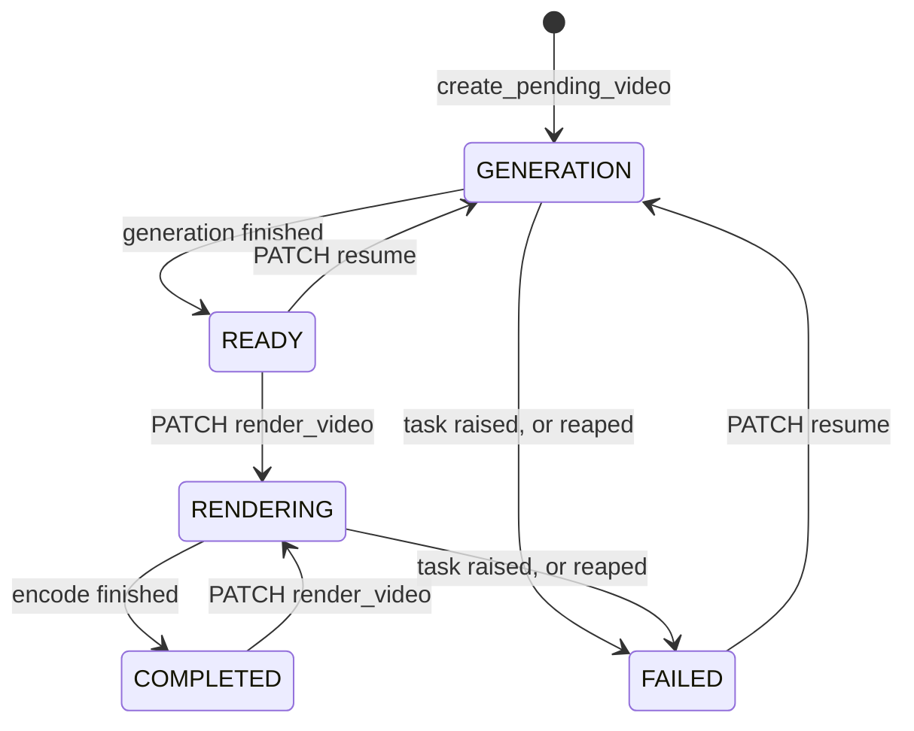

# How a video gets made

This walks the backend from an HTTP request to a finished `.mp4`. It is aimed at
someone about to change the generation or render pipeline and wondering where their
change belongs. For setup and usage see the [README](../README.md); for house rules
see [CONTRIBUTING](../CONTRIBUTING.md).

## The shape of it

Django + DRF serve the API. Everything expensive runs on a Celery worker, because a
generation takes minutes: an LLM call, one text-to-speech request per sentence, one
image or clip per sentence, then an ffmpeg encode. Nothing in that list belongs in a
request/response cycle.

So every entry point follows the same contract:

1. The view does the one cheap thing — create or claim a row — and returns `202`.
2. A Celery task does the work and moves the row's `status` along.
3. The client polls `GET /api/videos/{id}/` until the status settles.

That contract is why `create_pending_video` exists
([services/VideoGenerationServices.py](../backend/apps/videomanagement/services/VideoGenerationServices.py)):
it gives the caller an id to poll before any work has started. The row begins in
`GENERATION` with no `gpt_answer` and a placeholder title.

## Two ways in

**AI generation** builds a video from a prompt. **Twitch compilation** stitches
together clips pulled from the Twitch API. They produce the same row shape and share
the entire render half; only the way scenes get populated differs.

```
POST /api/generate/                 POST /api/twitch_generate/
  create_pending_video()              create_pending_video(video_type="TWITCH")
  generate_video_task.delay()         generate_twitch_video_task.delay()
        │                                     │
        ▼                                     ▼
  generate_video()                      generate_twitch_video()
```

The viewset is registered as `videos`, so the rest is
`GET /api/videos/{id}/`, `PATCH /api/videos/{id}/resume/` and
`PATCH /api/videos/{id}/render_video/`.

## The generation pipeline

`generate_video()` is the orchestrator. Each step writes to the database before the
next begins, which is what makes a partial failure resumable.

```
format_prompt()          build the prompt from template, genre, audience
      ▼
get_reply()              ask the LLM, parse JSON, retry up to 5 times
      ▼
generate_directory()     media/videos/<slug>/ with dialogues/ and images/
      ▼
  (save the Video: title, gpt_answer, dir_name, settings, voice)
      ▼
make_scenes_speech()     one Scene row per sentence, one .wav per Scene
      ▼
download_music()         optional backing track from YouTube
      ▼
create_image_scenes()    one SceneImage per sentence, via the provider registry
      ▼
  status = READY         charge_user()
```

**The script is the contract.** `get_reply()`
([utils/llm.py](../backend/apps/videomanagement/utils/llm.py)) routes to OpenAI, Claude
or Gemini on the model name, then insists on JSON of a particular shape — `check_json`
validates every key that `script_lines` later walks. A reply that fails validation is
retried; one that fails to parse at all is a `400`. The shape itself is built in
[defaults.py](../backend/apps/videomanagement/defaults.py) and varies: with narration
off, sentences carry only an `image_description`, and with a video provider selected
the brief asks for filmable shots rather than stills.

**Narration is optional.** `video.settings["narration"]` drives it. With narration on,
each sentence's `sentence` field is spoken and becomes the scene's timing source. With
it off there is no spoken line at all, so the shot description stands in as the scene's
identifying text (`scene_text()` in
[utils/prompt_utils.py](../backend/apps/videomanagement/utils/prompt_utils.py)) and the
visual's own audio is used instead.

**Image providers are a registry, not a branch.**
[utils/image_providers/\_\_init\_\_.py](../backend/apps/videomanagement/utils/image_providers/__init__.py)
maps `(mode, provider)` to a module-level function, and `resolve()` looks it up at call
time. `mode` is `WEB` (search: bing, google) or `AI` (generate: DALL-E, sora,
stable-diffusion, midjourney). Adding a provider is a new module plus one line in
`PROVIDERS`. Because `resolve()` looks the function up when it is called rather than at
import, patching a provider module in a test swaps what the pipeline uses.

One provider, `sora`, returns an `.mp4` rather than a still. The rest of the pipeline
does not special-case it — `process_scene` branches on the file extension — so a clip
flows through as just another scene visual.

## What the rows look like

```
UserPrompt ──┬── Video          (prompt, related_name="video_prompt")
             └── Scene ──── SceneImage
                 (one per sentence)   (the still or clip for it)
```

**Scenes hang off the `UserPrompt`, not off the `Video`.** This catches people out.
`video.prompt.scenes.all()` is how the render walks them, and it means two videos
sharing a prompt row also share scenes. Any lookup that assumes one row per
`(prompt, text)` is unsafe: two sentences in one script can carry identical text, so
the code filters and takes the first rather than calling `.get()`.

`Video.gpt_answer` holds the parsed script as JSON for an AI video, and a plain source
listing for a Twitch one. `Video.settings` is a JSON blob of the generation choices —
`narration`, `subtitles`, `style`, `provider`, `avatar_position` — and it is nullable,
so read it as `(video.settings or {})`.

## The status state machine



Transitions that a user can trigger are **claimed with a conditional update** rather
than read-then-write, so two clicks cannot start two workers:

```python
claimed = Video.objects.filter(
    pk=vid.pk, status__in=["READY", "COMPLETED"]
).update(status="RENDERING")
```

If `claimed` is 0 the row was not in a state that allows it, and the view returns
`409`. `make_video` re-checks the status itself, so the invariant does not rely on the
view alone.

**Failure is recorded by the task, not the service.** Each task in
[tasks.py](../backend/apps/videomanagement/tasks.py) wraps its service call and calls
`_mark_failed` before re-raising, so a crash anywhere in the pipeline still leaves the
owner with a `FAILED` row rather than a spinner.

**The reaper covers what a crash cannot.** A worker killed by OOM or a deploy never
reaches its own `except`, so `reap_stalled_videos` runs on a 15-minute beat and fails
anything sitting in `GENERATION` or `RENDERING` longer than `VIDEO_TASK_STALE_AFTER`
(3 hours by default).

## Resume

`resume_video()` takes no parameters. Everything it needs — the script, the directory,
the voice, the image mode — was settled on the first run and is on the row. It re-runs
the same two steps, and each skips what already landed:

- `make_scenes_speech` skips a Scene whose `file` exists on disk (`has_narration`).
- `create_image_scenes` skips a sentence that already has a SceneImage with a real file
  (`already_illustrated`).

Both check the filesystem rather than trusting the column, because a row can point at a
file that was never written. That is what makes resume cheap: nothing already paid for
is bought twice.

## The render pipeline

[utils/composer/](../backend/apps/videomanagement/utils/composer/) is one module per
stage, orchestrated by `make_video` in
[render.py](../backend/apps/videomanagement/utils/composer/render.py):

| module | what it does |
| --- | --- |
| `clips.py` | one scene → one moviepy clip; picks the audio, fits the visual to it |
| `subtitles.py` | a styled `TextClip` per scene |
| `layers.py` | background masking and the music bed |
| `avatar.py` | the SadTalker talking head, composited into a corner |
| `overlay.py` | ffmpeg `drawtext`, used for Twitch clip titles |
| `render.py` | walks the scenes, concatenates, writes the file |

Per scene, `make_video` builds the audio first and the visual second, because **the
narration is the source of truth for timing**. A still is held for as long as the
narration runs; a clip is trimmed if it is longer and freeze-framed on its last frame
if it is shorter. A scene with no usable visual falls back to a black clip rather than
failing the render.

Then everything is concatenated, the background, music, avatar, subtitles, intro and
outro are layered on, and the result is written with `libx264` + `aac` — aac
explicitly, because moviepy defaults to mp3 and Safari and QuickTime silently drop an
mp3 track inside an mp4.

Every clip is closed in a `finally`. moviepy clips hold ffmpeg subprocesses, so leaking
them on a long video exhausts file handles.

## Where money is spent

`charge_user()` in
[utils/cost_utils.py](../backend/apps/videomanagement/utils/cost_utils.py) runs at the
end of a successful generation and decrements the user's limit field with an `F()`
expression. Per-user API keys come from `ApiKeys.key_for(user, provider)` — every
provider call takes a `user` so it can spend that user's key rather than the service's.
The rate limits on the generate, resume and render endpoints are DRF throttles, listed
on the viewset actions in
[views/video_view.py](../backend/apps/videomanagement/views/video_view.py).

## If you are adding something

| you want to | go to |
| --- | --- |
| add an image or video provider | a module in `utils/image_providers/` + a line in `PROVIDERS` |
| add a TTS provider | `utils/tts_utils.py`, plus `api_providers` and a `Provider` enum member |
| add an LLM | `utils/llm.py`, plus a prefix in `model_calls` |
| change the script's shape | `defaults.py` for the prompt, `check_json` for validation, `script_lines` for the walk — all three, or the retry loop will not catch a bad reply |
| add a render stage | a module in `utils/composer/`, called from `handle_final_video` |
| change what a scene costs | the `costs` table in `utils/cost_utils.py` |

Tests mirror the source tree — `tests/services/`, `tests/utils/`, `tests/composer/`,
`tests/image_providers/`, `tests/api/`. Nothing in the suite reaches the network; the
provider calls are patched at the module the pipeline resolves.
