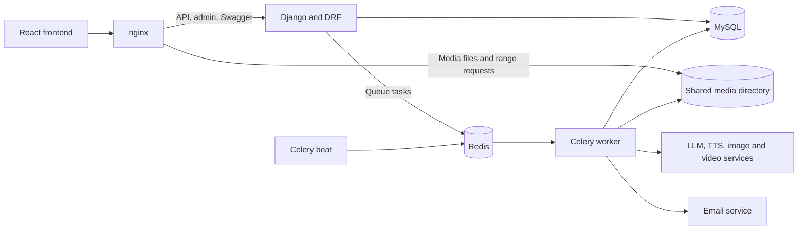
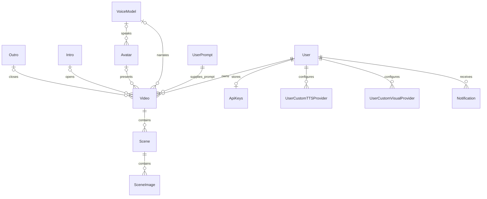
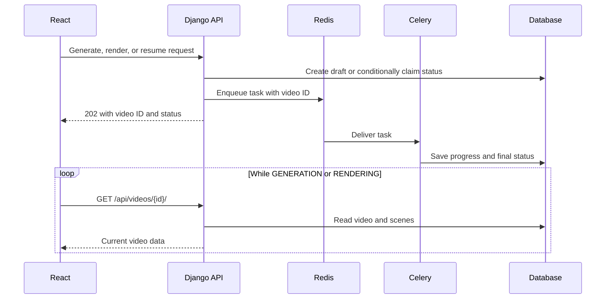
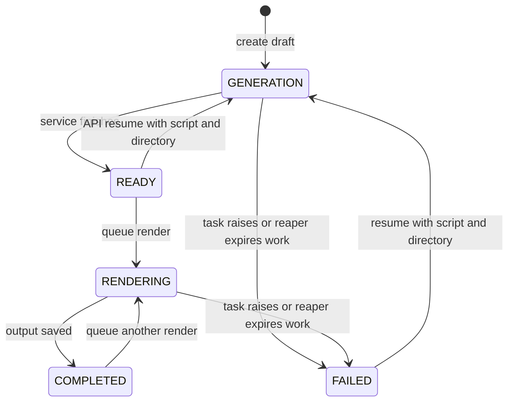

# Architecture

Viddie turns a prompt into an editable video draft, then renders that draft into an
MP4. Django owns the data and API; Celery runs full generation and rendering; React
provides the generation form, scene editor, media libraries, and provider settings.

This document describes the current implementation, including its recovery behavior
and limitations. For installation and screenshots, see the [README](../README.md).
For contribution guidelines, see [CONTRIBUTING](../CONTRIBUTING.md).

## System overview


```mermaid
flowchart LR
    Browser[React frontend] --> Nginx[nginx]
    Nginx -->|API, admin, Swagger| Django[Django and DRF]
    Nginx -->|Media files and range requests| Media[(Shared media directory)]
    Django --> DB[(MySQL)]
    Django -->|Queue tasks| Redis[(Redis)]
    Beat[Celery beat] --> Redis
    Redis --> Worker[Celery worker]
    Worker --> DB
    Worker --> Media
    Worker --> Providers[LLM, TTS, image and video services]
    Worker --> Email[Email service]
```

The Docker stack is defined in [docker-compose.yml](../backend/docker-compose.yml).
The frontend's [nginx configuration](../frontend/nginx.conf) serves the React build,
proxies Django routes, and serves `/media/` directly with range-request support.
The backend and worker share the backend checkout through a bind mount; nginx mounts
its media directory read-only. Redis carries Celery messages and task results.

The database's `Video.status` is the status exposed to the UI. The frontend polls the
video endpoint rather than querying Celery's result backend. The supplied worker
startup uses Celery's `solo` pool, so one worker process executes one task at a time;
ffmpeg's encoding threads do not make the task queue concurrent.

## Code map

| Area | Responsibility | Entry points |
| --- | --- | --- |
| Frontend pages and components | Generation, scene editing, media libraries, provider management | [`frontend/src/pages/`](../frontend/src/pages/), [`frontend/src/components/`](../frontend/src/components/) |
| Frontend API layer | Consistent response envelope, authentication clients, polling | [`frontend/src/api/`](../frontend/src/api/) |
| Video API | Validate requests, check access, create or claim videos | [`videomanagement/views/`](../backend/apps/videomanagement/views/) |
| Video services | Coordinate generation, recovery, and edits | [`videomanagement/services/`](../backend/apps/videomanagement/services/) |
| Background tasks | Invoke services, record failures, import voices, reap stalled work | [`videomanagement/tasks.py`](../backend/apps/videomanagement/tasks.py) |
| Media utilities | Script processing, narration, visual providers, composition | [`videomanagement/utils/`](../backend/apps/videomanagement/utils/) |
| Provider credentials | Built-in keys, custom TTS configuration, masked API responses | [`apikeysmanagement/`](../backend/apps/apikeysmanagement/) |
| Accounts and notifications | Authentication, password reset, notifications, email tasks | [`usermanagement/`](../backend/apps/usermanagement/) |

## Data model


```mermaid
erDiagram
    User ||--o{ Video : owns
    UserPrompt ||--o{ Video : supplies_prompt
    Video ||--o{ Scene : contains
    Scene ||--o{ SceneImage : contains
    VoiceModel o|--o{ Video : narrates
    VoiceModel o|--o{ Avatar : speaks
    Avatar o|--o{ Video : presents
    Intro o|--o{ Video : opens
    Outro o|--o{ Video : closes
    User ||--o| ApiKeys : stores
    User ||--o{ UserCustomTTSProvider : configures
    User ||--o{ UserCustomVisualProvider : configures
    User ||--o{ Notification : receives
```

[models.py](../backend/apps/videomanagement/models.py) defines the video and media
models. **Scenes belong directly to `Video`**, through `Scene.video` and the reverse
relation `video.scenes`. A `UserPrompt` stores the original prompt text; it does not
own scenes. `SceneImage` stores either a still or video clip and can opt into the
clip's own audio through `with_audio`.

| Model or field | Meaning |
| --- | --- |
| `Video.gpt_answer` | Parsed JSON script for AI videos; a source listing for existing Twitch videos |
| `Video.dir_name` | Working directory for the script's generated media and final output |
| `Video.settings` | JSON choices including narration, subtitles, style, provider, and avatar position; read as `(video.settings or {})` |
| `Video.voice_model` | Selected voice, or the selected avatar's voice; nullable |
| `Scene.text` | Spoken dialogue, or the visual description when narration is disabled |
| `Scene.file` | Narration audio reference; a populated field does not guarantee the file exists |
| `Scene.scene_images` | Related visual records; the editor and renderer currently select the first |
| `VoiceModel.provider` | Canonical built-in identifier or the owning user's custom-provider name |
| `VoiceModel.path` | Voice identifier passed to the TTS service |
| `VoiceModel.type` | `API` for built-in providers; `CUSTOM_API` for user-configured providers |

Generation currently matches scenes by text. Repeated identical sentences can
therefore resolve to the same scene; text is not a unique scene identifier.

## HTTP and background work

Full generation, rendering, and resuming use the same asynchronous contract:


```mermaid
sequenceDiagram
    participant UI as React
    participant API as Django API
    participant Queue as Redis
    participant Worker as Celery
    participant DB as Database
    UI->>API: Generate, render, or resume request
    API->>DB: Create draft or conditionally claim status
    API->>Queue: Enqueue task with video ID
    API-->>UI: 202 with video ID and status
    Queue->>Worker: Deliver task
    Worker->>DB: Save progress and final status
    loop While GENERATION or RENDERING
        UI->>API: GET /api/videos/{id}/
        API->>DB: Read video and scenes
        API-->>UI: Current video data
    end
```

A `202` means work was queued, not that generation or encoding has completed.

| Endpoint | Behavior |
| --- | --- |
| `POST /api/generate/` | Validate choices, create a `GENERATION` draft, enqueue generation; return `202` |
| `GET /api/videos/` | Paginated owner-scoped library with title search and status filtering; drafts without a script are omitted |
| `GET /api/videos/{id}/` | Video details, scenes, visuals, and narration status; unfinished drafts remain accessible for polling |
| `PATCH /api/videos/{id}/` | Update title, avatar, intro, outro, and settings; an avatar voice change regenerates narration synchronously |
| `PATCH /api/videos/{id}/render_video/` | Claim `READY` or `COMPLETED` as `RENDERING`, enqueue encoding; return `202` |
| `PATCH /api/videos/{id}/resume/` | Claim `FAILED` or `READY` as `GENERATION` when a script and directory exist; return `202` |
| `POST /api/videos/{id}/add_scene/` | Add a scene and its media synchronously |
| `PATCH /api/scenes/{id}/` | Save dialogue and attempt narration synchronously; also return `narration_status` |
| `PATCH /api/scenes/{id}/generate/` | Return an AI rewrite for review; saving it is a separate request |
| `POST /api/scenes/{id}/change_image_scene/` | Upload a visual or update an existing visual belonging to that scene |
| `POST /api/scenes/{id}/generate_image_scene/` | Generate a visual synchronously for an authorized scene |
| `POST /api/twitch_generate/` | Temporarily disabled; eligible authenticated requests receive `503` without creating or queueing a video |

Twitch's service and task remain for existing data and future re-enablement. Its
frontend flag is in [features.js](../frontend/src/config/features.js); the independent
backend flag is in [settings/base.py](../backend/video_creator/settings/base.py).

Generate and resume are throttled at two requests per hour, and render at one per day,
with an explicit superuser exemption; see [throttling.py](../backend/apps/videomanagement/throttling.py).

Scene edits and uploads do **not** follow the background-task contract. Provider
calls in these routes still run inside the request.

## Generation pipeline

[VideoGenerationServices.py](../backend/apps/videomanagement/services/VideoGenerationServices.py)
contains `create_pending_video()`, `generate_video()`, and `resume_video()`.

1. **Resolve selections.** Validate the owner's avatar, intro, outro, and available
   voice before provider work. Request validation performs these checks before
   creating the draft; the worker repeats them before generation.
2. **Build the script.** `script_format()` and `format_prompt()` combine narration
   mode, visual provider, prompt, genre, and target audience. `get_reply()` routes to
   an LLM and validates the returned JSON. An existing script and directory can be
   reused when generation is invoked again for that video.
3. **Persist the draft.** Save the generated title, script, working directory, settings,
   selected assets, and voice.
4. **Attempt narration.** `make_scenes_speech()` creates scene rows and attempts TTS
   for lines without an existing narration file.
5. **Attempt background music.** Music is optional; blank input is accepted and music
   download errors are logged without stopping generation.
6. **Attempt visuals.** `create_image_scenes()` uses the selected web, image, or video
   provider. Individual provider failures can leave visual records without a file.
7. **Finish the draft.** Set `READY`, save the video, and deduct the calculated
   generation cost.

The script format is shared by [defaults.py](../backend/apps/videomanagement/defaults.py),
`check_json()` in [llm.py](../backend/apps/videomanagement/utils/llm.py), and
`script_lines()` in [prompt_utils.py](../backend/apps/videomanagement/utils/prompt_utils.py).
Change these together when changing the LLM output shape. Without narration, visual
descriptions supply scene text instead of spoken sentences. Video providers receive
shot-oriented descriptions.

### Narration failures and retry

**A narration failure intentionally does not discard the draft or fail the entire
video.** Generated dialogue and visuals remain editable, and generation can reach
`READY` with missing narration.

[SceneSerializer](../backend/apps/videomanagement/serializers.py) exposes a computed
`narration_status` for each scene:

| Value | Meaning |
| --- | --- |
| `available` | `has_narration()` finds the referenced audio file |
| `missing` | Narration is enabled, but no referenced audio file exists |
| `disabled` | Narration is off, or the video is a Twitch compilation |

This status is derived from the video settings and filesystem, not stored as a
separate failure flag. It checks file existence, not audio decoding or quality.

The [editor](../frontend/src/pages/VideoPage.js) lists affected scenes.
[Scene.js](../frontend/src/components/Scene.js) offers **Retry narration**, using the
existing scene PATCH endpoint with unchanged text. The response distinguishes a
successful audio retry from another missing-audio result. Saving dialogue also warns
when narration remains unavailable.

[RenderModal.js](../frontend/src/components/RenderModal.js) fetches fresh video details
before confirmation, including when opened from the library. It identifies missing
narration and offers **Render anyway**. Narration-off videos show no warning. This
check is advisory: the backend allows rendering with missing narration.

## State transitions and recovery


```mermaid
stateDiagram-v2
    [*] --> GENERATION: create draft
    GENERATION --> READY: service finishes
    GENERATION --> FAILED: task raises or reaper expires work
    READY --> RENDERING: queue render
    COMPLETED --> RENDERING: queue another render
    RENDERING --> COMPLETED: output saved
    RENDERING --> FAILED: task raises or reaper expires work
    FAILED --> GENERATION: resume with script and directory
    READY --> GENERATION: API resume with script and directory
```

[VideoView](../backend/apps/videomanagement/views/video_view.py) claims render and resume
transitions with a conditional database update. Competing requests that no longer
match an allowed status receive `409`. The frontend also disables the render action
while submitting or while the video is `RENDERING`. The API accepts resuming a `READY`
video; the current UI offers **Carry on** for `FAILED` videos.

Tasks in [tasks.py](../backend/apps/videomanagement/tasks.py) catch exceptions escaping
the service, mark the video `FAILED`, and re-raise. Narration, music, and visual errors
handled inside the service do not necessarily trigger that path.

`resume_video()` reuses the saved script, directory, voice, mode, and provider settings.
It attempts missing narration and visuals, skips files already present, and returns
the video to `READY`. It does not call the generation charge function again. A video
that never obtained a script and directory cannot be resumed.

Celery beat runs `reap_stalled_videos()` every 15 minutes. It marks in-flight videos
whose `updated_at` is older than `VIDEO_TASK_STALE_AFTER` as failed; the default is
three hours. This is a timestamp-based recovery mechanism, not a worker heartbeat.

## Provider routing and credentials

### Built-in keys and voice availability

[ApiKeys.key_for()](../backend/apps/apikeysmanagement/models.py) chooses credentials
using `user.use_service_api_keys`:

- Service-key mode reads the configured service credential.
- Own-key mode reads that user's encrypted key; it does not fall back to the service
  key when the user has no saved credential.

TTS identifiers are `Provider.OPENAI`, `Provider.ELEVENLABS`, and `Provider.SIXTYDB`.
Display names such as “OpenAI” and “60dB” are labels, not persisted provider IDs.

`VoiceModel.available_to(user)` is the shared source for the voice picker and explicit
voice selection. OpenAI voices can be shared across accounts. ElevenLabs and 60dB
voices are account-specific: service voices are offered with service keys, and owned
voices with personal keys. Custom voices are offered in own-key mode. A built-in
provider without a reachable credential is excluded.

Key changes for ElevenLabs and 60dB enqueue voice imports after commit. Imports validate
incoming records before removing stale voices, update existing rows while preserving
IDs, and create new rows. A failed fetch represented by `None` preserves the existing
catalogue; a successful empty list removes that user's provider voices.

### Shared custom-provider foundation

`AbstractCustomProvider` holds the common owner, name, endpoint, authentication,
and encrypted-credential fields, plus authentication-header construction. TTS and
visual providers inherit these fields into their own database tables. The base is
abstract and does not create a separate provider table.

`CustomProviderSerializer` shares owner assignment, immutable/reserved-name validation,
header-authentication validation, and credential masking. `CustomProviderViewSet`
shares authenticated CRUD and owner-scoped querysets. Concrete serializers retain
provider-specific fields, reserved names, and per-user uniqueness validators.

Both provider types accept an `extra_parameters` JSON object (default `{}`), such as
`{"model": "my-model", "seed": 42, "options": {"quality": "high"}}`. Generation
POSTs merge those fields with the configured prompt or text/voice fields; generated
prompt, text, and voice values take precedence. Arrays, scalars, and `null` are
rejected. PATCH preserves omitted parameters, replaces a supplied object, and clears
parameters when given `{}`. These are ordinary request options; credentials belong
in the encrypted authentication field. The voice and visual provider editors expose
a JSON input under advanced request settings.

### Custom TTS providers

Each `UserCustomTTSProvider` belongs to one user. Its name is unique for that user,
cannot use a reserved built-in identifier, and cannot be renamed after creation.
Voice records use that name as their provider identifier.

| Route | Purpose |
| --- | --- |
| `/api/api_keys/` | Read, update, or clear built-in credentials and the key-source preference |
| `/api/user-custom-tts-providers/` | List or create owned provider configurations |
| `/api/user-custom-tts-providers/{id}/` | Read, edit, or delete an owned provider |
| `/api/user-custom-tts-providers/{id}/update-voices/` | Queue a voice import; return `202`, not an import-completion result |

[TTSRegistry](../backend/apps/videomanagement/utils/tts_utils.py) dispatches built-in
names to their registered handlers and other names to the custom-provider handler.
Custom synthesis resolves configuration by **user and provider name**, POSTs JSON
using configurable text and voice field names, and supports bearer, header, basic,
or no authentication. Returned audio is written to disk; empty output is rejected,
and a failed custom download removes partial output.

Creating a provider queues its first voice import. Editing one does not automatically
refresh voices; the UI exposes **Refresh voices**. Deleting it removes its owned
voice records. Credentials are encrypted in the database and masked in API responses.

The optional voices URL accepts a list or a `voices`/`data` wrapper. Custom entries use
`id`, `name`, and optional `preview_url`. The current catalogue GET does not apply the
synthesis authentication settings, so authenticated catalogue endpoints need additional
implementation. The synthesis endpoint's authentication is applied to its POST.

### Custom visual providers

`UserCustomVisualProvider` stores an `output_type` of `IMAGE` or `VIDEO`, a connection
URL, shared authentication settings, a configurable `prompt_field_name` (default
`prompt`), and creation/update timestamps. Names are unique per user and immutable;
built-in visual provider names are reserved.

| Route | Purpose |
| --- | --- |
| `/api/user-custom-visual-providers/` | List owned configurations or create an image/video provider |
| `/api/user-custom-visual-providers/{id}/` | Read, update, or delete an owned configuration |

Omitting `api_key` during an update preserves it; sending an empty string clears it.
Read responses contain a masked value. Foreign provider IDs return `404`.

The visual adapter in [custom.py](../backend/apps/videomanagement/utils/image_providers/custom.py)
retrieves the selected configuration for the video owner and posts the prompt under
`prompt_field_name`, using its configured authentication and extra parameters. It
accepts raw media bytes or a JSON response containing `url`, `image_url` for images,
or `video_url` for videos, including those fields in the first `data` entry.
Media URLs must use HTTP or HTTPS. Downloads do not receive the provider's
credentials, and the initial POST does not follow redirects.

Image requests have a 30-second timeout; video requests allow 300 seconds. Pillow
validates images and normalizes them into uniquely named PNGs. MoviePy validates
video clips before ffmpeg converts them into MP4 with H.264 video and AAC audio,
preserving sound when present. Conversion has a 300-second timeout. Request, decoding, and
storage failures return `None` through the existing scene failure path, removing
any partially saved output. Temporary downloads are cleaned up. Missing or foreign
configurations are rejected. Custom video providers also receive motion-oriented
script descriptions, determined from their owner's configuration.

The API settings page has separate tabs for built-in keys, custom voice providers,
and custom image/video providers. Visual configurations support creation, editing,
and confirmed deletion with preserved credentials and unsaved drafts. The generation
form lists owned providers in separate custom image and custom video groups when
AI visuals are selected; unavailable saved providers must be replaced before generation.
Custom visual providers use their configured credentials independently of the built-in
key-source toggle.

Connection checks and asynchronous job polling are not connected yet.
Providers must return completed media bytes or a completed media URL;
a response containing only a job ID is not supported.

### Visual and LLM providers

[ImageProviderRegistry](../backend/apps/videomanagement/utils/image_providers/registry.py)
uses the same registration pattern as `TTSRegistry`: module-level handlers register
through decorators, and lookup resolves their current module attributes at call time.
This keeps provider calls patchable in tests. Importing
[image_providers/__init__.py](../backend/apps/videomanagement/utils/image_providers/__init__.py)
loads the adapters and registers them. Existing callers continue to use
`resolve(mode, provider)`.

```python
@ImageProviderRegistry.register("my-built-in")
def generate(prompt, directory, user=None, **kwargs):
    # Produce a media file and return its path.
    ...
```

Registration defaults to `mode="AI"` and `output_type="IMAGE"`. Web search adapters
use `mode="WEB"`; video adapters use `output_type="VIDEO"`, which populates
`VIDEO_PROVIDERS`. `ImageProviderRegistry.is_video(name, user)` combines built-in
metadata with an owner-scoped lookup of custom configurations for script formatting.
Omitted provider names retain the defaults
`DALL-E` for AI and `bing` for web search.

`register_fallback(mode="AI")` exposes a custom-adapter hook. Explicit registrations
win over that fallback. The compatibility resolver binds the selected custom name as
`provider_name`, while forwarding the normal prompt, directory, user, and generation
options. Fallbacks are scoped by mode, so an AI fallback does not capture web searches.
The custom visual HTTP adapter is registered as the AI fallback. Unknown AI provider
names must identify an owned custom configuration; unknown web provider names use
the web default. Unsupported modes
raise `ValueError`; scene generation handles this through its existing failure path.
Callers can invoke the resolved handler directly without checking for `None`.

| Mode | Provider identifiers |
| --- | --- |
| `WEB` | `bing`, `google` |
| `AI` | `DALL-E`, `sora`, `stable-diffusion`, `midjourney` |

`DALL-E` remains the visual provider's routing identifier, while the OpenAI adapter
uses the configured image model. It is separate from the canonical `OPENAI` credential
and TTS identifier. `sora` produces video clips; composition chooses still or video
handling from the file extension. LLM routing lives in `model_calls` in
[llm.py](../backend/apps/videomanagement/utils/llm.py).

## Ownership boundaries

Video querysets are scoped to the caller. Asset selection in
[asset_selection.py](../backend/apps/videomanagement/services/asset_selection.py)
requires the avatar, intro, and outro to belong to the video owner and resolves them
before mutations or external generation work. Missing and foreign assets both return
`404`. Explicit voices must be available to that owner; avatar voice edits use the
caller's available voice queryset.

Scene mutations call `get_object()` to apply object permissions. Permissions follow
`Scene.video` and `SceneImage.scene.video`; the explicit superuser exception remains.
A supplied `scene_image` must belong to the target scene, even when both scenes belong
to the same user. Custom-provider querysets are always scoped to their user.

These are API boundaries. nginx's direct `/media/` delivery does not perform the
video API's ownership checks; private media delivery requires a separate design.

## Rendering and file storage

[composer/render.py](../backend/apps/videomanagement/utils/composer/render.py)
coordinates MoviePy and ffmpeg:

| Module | Responsibility |
| --- | --- |
| `clips.py` | Load narration or clip audio; size and time each scene's visual |
| `subtitles.py` | Build timed subtitle clips |
| `layers.py` | Apply background composition and optional music |
| `avatar.py` | Generate and overlay a SadTalker presenter |
| `overlay.py` | Add text overlays for Twitch clips |
| `render.py` | Assemble scenes, apply final layers, encode, save output and status |

With narration enabled, scene audio determines visual duration. Clip audio can be
mixed in when `with_audio` is set. Unavailable narration falls back to blank audio;
unavailable visuals fall back to a black image. With narration off, video clips keep
their duration unless their own selected audio supplies timing; stills use
`SILENT_SCENE_SECONDS` when there is no audio.

The renderer assembles the scenes, applies background/music/avatar/subtitle layers,
and prepends or appends selected intro/outro clips. Output uses `libx264` video and
`aac` audio at 24 fps. Final assembly closes tracked clips in a `finally` block.
Successful encoding saves `Video.output` and marks the video `COMPLETED`.

Generated files normally live under:

```text
media/videos/<generated-title>/
├── dialogues/         # Scene narration
├── images/            # Generated or downloaded visuals
├── output_audio.wav
└── output_video.mp4
```

Uploaded avatars, intros, outros, and scene visuals have their own FileField upload
paths. The worker needs access to media, ffmpeg, ImageMagick, and the avatar model
weights. Its startup script downloads missing weights; running workers must be
restarted after backend code changes because they do not reload automatically.

## Frontend API and notifications

[apiService.js](../frontend/src/api/apiService.js) defines resource helpers around
[request.js](../frontend/src/api/request.js). Every helper resolves the same result:

```js
{ ok, data, status, headers, message, errors }
```

Callers check `ok` or valid `data` before changing UI state. The shared helper converts
validation errors into readable messages and normally displays an error toast;
callers with their own error UI can suppress it. Axios chooses JSON versus multipart
encoding, and search/pagination values use query parameters.

The private Axios client receives authorization and CSRF headers through
[useAxiosPrivate](../frontend/src/hooks/useAxiosPrivate.js). Its interceptor refreshes
and retries once on `401`; `403` permission denials are not treated as expired tokens.
Cookie and bearer-token authentication is implemented by
[CustomAuthentication](../backend/apps/usermanagement/authenticate.py); its explicit
CSRF enforcement call is currently commented out.

[pollVideo.js](../frontend/src/api/pollVideo.js) polls every four seconds while a video
is `GENERATION` or `RENDERING`. Defaults are a three-hour timeout and five consecutive
request failures. A polling timeout or unreachable API means tracking stopped, not
that the backend job necessarily failed.

Video lifecycle hooks create an owner-scoped `Notification` and enqueue email when
status changes to `COMPLETED` or `FAILED`. The notification bell polls every 30 seconds
and supports marking one or all entries read. Missing narration on a `READY` video
is reported by scene status and editor warnings, not a video-failure notification.

## Charging and current limitations

[cost_utils.py](../backend/apps/videomanagement/utils/cost_utils.py) calculates generation
cost from video type, scene count, voice type, and populated visual file references.
`charge_user()` uses an `F()` expression for the balance deduction. Scene edits and
visual regeneration have separate deductions in their API handlers.

An atomic balance decrement is not an idempotent charge: generation currently has no
per-video charge ledger, and deductions do not enforce a non-negative balance.
Conditional status claims guard competing API render/resume requests, but do not make
worker execution idempotent. Creating/claiming a video and publishing its Celery task
are also separate operations; a broker failure can leave an in-flight row for the
reaper to handle.

The supplied Compose stack is a development environment. Django starts with
`runserver`; production settings are available separately. Missing narration warnings
preserve the intended partial-success behavior and do not make the deployment
production-ready by themselves.

## Extending and verifying the system

| Change | Files to start with |
| --- | --- |
| Add a visual provider | New module in `utils/image_providers/`, registration decorator, package import, frontend provider choices |
| Add a built-in TTS provider | `Provider`, `ApiKeys.FIELDS`, `TTSRegistry` handler, voice availability/import rules, frontend key controls |
| Connect a user-defined TTS service | Custom-provider configuration and voice import; no registry code change for each user's service |
| Add an LLM | `llm.py` routing and accepted model settings |
| Change script structure | `defaults.py`, `check_json()`, and `script_lines()` together |
| Add a composition layer | `utils/composer/` and `handle_final_video()` |
| Change ownership behavior | Owner-scoped querysets, `permissions.py`, `asset_selection.py`, API and service regressions |
| Change recovery behavior | Task wrappers, `resume_video()`, file-existence helpers, reaper, frontend polling |
| Change cost calculation | `cost_utils.py` and scene endpoint deductions |

Backend tests are grouped under `tests/api/`, `tests/services/`, `tests/utils/`,
`tests/composer/`, and `tests/image_providers/`, with credential/account tests in their
own apps. Provider requests are mocked in regression tests.

Run the application suites with explicit labels, so Django does not collect the
vendored avatar project's unrelated tests:

```sh
cd backend
docker compose exec video_creator python manage.py test \
  apps.usermanagement apps.videomanagement apps.apikeysmanagement --keepdb
```

For frontend changes, build the app and inspect the relevant flows in a browser.
